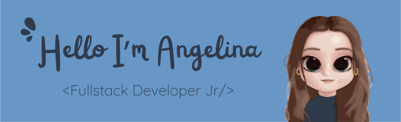

My adventure in web development began with a passion for graphic design, a hobby I greatly enjoy. My design skills help me every day to create stunning layouts for websites.

My curiosity about building a website led me to learn WordPress, which allowed me to apply my creativity in a practical environment. However, other interests led me to explore digital marketing through a course that taught me how to build irresistible brand identities and connect with audiences effectively. Once this was completed, I felt the need to go further. I not only wanted to design and apply my knowledge but also to understand the code that brings websites to life.

This drove me to join Factoria F5’s bootcamp, where the constant and immersive learning environment enabled me to acquire technical skills in web development and discover a genuine passion for the field. The Learning by Teaching and Learning by Doing methodology was fundamental in this process, allowing me to tackle real challenges, collaborate in teams, and grow professionally. Thanks to this experience, I have developed a robust set of skills that I invite you to view in my professional profile.

---
### Frontend:

### Backend:

### Testing:

### Version Control:

### Agile Methodologies:

### Hosting:

### Design Tools:

### Other Tools:

### Documentation:

# GitHub Stats 📊

  
  
  

---

